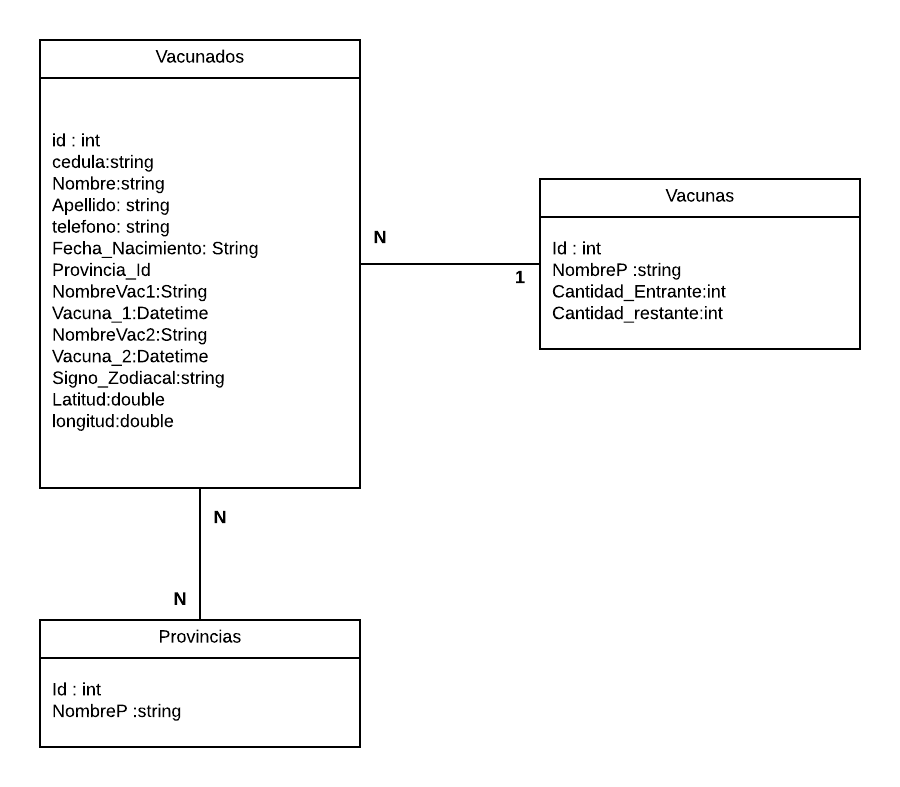

# Diagrama
</img>

# Registrar Vacuna

* Para registrar una persona que se vacuna deben digitar la cedula de la persona 

    - y verificarla en el patrón para si la misma se encuentra
    -  llenar los campos correspondientes,
    -  si no esta los mismos aparecerán en blanco. 
    -  Para registrar una persona se llenaran los campos:
    -  nombre,
    - apellido,
    - teléfono
    - fecha de nacimiento,
    - vacuna recibida (de un select),
    - provincia (de un select)
    - y la fecha en la cual se registra esta primera dosis.
    -  Si al momento de registrar una vacuna la persona ya se le ha registrado una vacuna,
    -  entonces solo apareceran los datos anteriores a modo consulta,
    -  se visualizara cuando fue la primera dosis y luego se colocara la fecha de esta segunda que se esta aplicando.

# Consulta de Vacunados

* Se podrá buscar entre los vacunados por 

    - Nombre 
    -  Apellido
    - para saber si han recibido un o las dos dosis.

# Listado de vacunados por provincia: 

* Se podrá elegir una provincia de las agregadas y de desplegar un listado con las personas que se han vacunado de esta provicia. Mostrar:
    - cedula
    - nombre
    - apellido
    - teléfono
    -  fecha 1ra vacuna
    - fecha 2da vacuna. 

# Listado de vacunados por marca de vacuna

*  Aparecerá un listado con todas las vacunas registradas
* cuantas personas se han vacunado de la misma.
* Agregarle algún grafico interesante. 

## Creacion de graficos
Pagina para hacer graficos

[Link graficos](https://www.chartjs.org/docs/latest/?q=)

# Listado de vacunados por signo zodiacal.

- Muestre una tabla con todos los signos zodiacales
- y la cantidad de personas que se han vacunado de ese signo y están registrados en nuestro sistema

# Anular registro de vacunacion

- Vamos a digitar una cedula de un vacunado.
- y vamos a poder eliminar el registro de que se vacuno. 
- Esto es por si lo agregaron por error.

# Configuracion.

- Aquí podremos registrar agregando las vacunas que tengamos en existencia.
- Colocando la marca y la cantidad.
- El sistema debe llevar un inventario
- Y no permitir registrar vacunados si no existen vacunas en almacén.  
- Se podrán registrar las provincias que aparecen en nuestro sistema al momento de elegir.
- O cambiar el nombre de una provincia si fuera necesario. 

# Tarea 8

- Modifique su tarea 7.
- vamos a agregarle que al momento de registrar una persona vamos a indicar la latitud y longitud de donde se hace esa vacunación.
- A la tarea 7 agréguele una opción para mirar en modo mapa,
- Donde aquí aparecerá un marcador por cada persona que se ha registrado en nuestro sistema.
- Al hacer click en un marcador, vamos a visualizar los datos de la persona, así como que vacuna recibió y cuantas dosis de la misma se ha puesto. 0